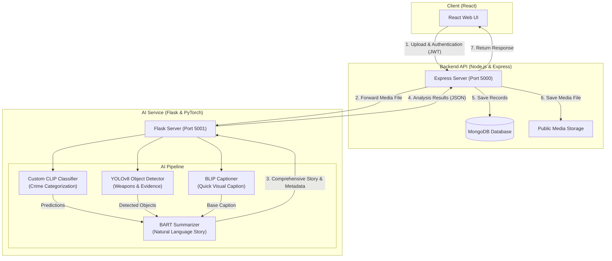

# 🧠 SceneSolver: AI-Powered Crime Detection & Scene Summarization Platform

SceneSolver is a production-quality, AI-driven visual surveillance analysis system designed to identify, categorize, and summarize criminal activities or emergencies from uploaded images and videos. By utilizing a hybrid multi-model AI pipeline, SceneSolver automates the extraction of key evidence, classifies the visual context (e.g. robbery, assault, fire), and generates a coherent natural language narrative.

Built as a decoupled microservices architecture, the application integrates a **React SPA frontend**, a **Node.js/Express API gateway**, a **MongoDB database**, and a high-performance **Flask AI/ML service** powered by **PyTorch**.

---

## 🎥 Demo Videos

### 1. Project Introduction & Explanation
[](https://screenapp.io/app/v/PpT1QflqpW)
*Covers Introduction, Objectives, usecases, beneficiaries, dataset, preprocessing, technology stack, architecture & conclusion*

### 2. Core Platform Overview & Upload Workflow
[](https://youtu.be/yhTDmQ89GpQ?si=FN_ZAqS95t-N7ZOP)
*A walk-through of user registration, dashboard navigation, uploading visual evidence, and observing the real-time AI classification, object detection overlays, and summarized results.*

---

## 🚀 Key Features

* **Visual Crime Categorization**: Uses a custom-head CLIP model trained to distinguish between robbery, shoplifting, fighting, explosion, and normal scenarios.
* **Granular Object & Evidence Detection**: Employs custom YOLOv8 to locate and outline physical evidence (e.g., weapons, flames, combatants).
* **Multi-Modal Narrative Generation**: Leverages BLIP to caption the frame and BART to fuse object labels with CLIP predictions into a readable incident report.
* **Secure JWT Session Management**: Provides complete user authentication, protecting upload and history endpoints with token-based access.
* **Surveillance Log Dashboard**: Displays a paginated history of a user's previous analyses, allowing easy auditing of past cases.

---

## 🛠️ Tech Stack

* **Frontend**: React (ES6+), Vanilla CSS (Modular Styles), Axios.
* **Backend**: Node.js, Express.js, Mongoose.
* **AI/ML Engine**: PyTorch, Transformers (Hugging Face), Ultralytics YOLOv8, Flask.
* **Database**: MongoDB (Local Instance / Atlas).
* **Launcher**: Windows CLI Batch and PowerShell runners.

---

## ⚙️ System Architecture



### API Communication Flow
1. **Frontend Submit**: The user uploads media on the React app. The client issues a `POST /api/analysis` request with a JWT header.
2. **Express Validation**: Express verifies the token, saves the file in a temporary folder, and forwards the file payload as `multipart/form-day` to Flask.
3. **AI Pipeline Execution**: Flask runs CLIP, YOLO, and BLIP, combines their outputs, and sends the text representation to BART for final summarization.
4. **Database Insertion & Response**: Flask returns the structured results. Express saves the record to MongoDB, moves the media file to `public/media/`, generates a public URL, and responds with `201 Created`.

---

## 🤖 AI Pipeline Explained

SceneSolver implements a sequential reasoning pipeline that mimics how a human investigator reviews evidence:

1. **CLIP (Contrastive Language-Image Pre-Training)**: Evaluates global semantic context. It uses a custom projection layer over `openai/clip-vit-base-patch32` to output probabilities for 5 target crime classes (robbery, shoplifting, fighting, explosion, normal).
2. **YOLOv8 (You Only Look Once)**: Evaluates local objects. It scans the frame to detect specific object boxes and confidence percentages (such as handguns, knives, combatants, or flames).
3. **BLIP (Bootstrapping Language-Image Pre-training)**: Generates a high-level caption of the visual features (e.g. "a person holding a tool").
4. **BART (Bidirectional Auto-Regressive Transformers)**: Acts as the pipeline's natural language coordinator. It ingests the structured output from YOLO (detected objects), CLIP (crime category prediction), and BLIP (base caption) and synthesizes them using a text generation template to output a cohesive incident summary (e.g. *"The image has been classified as a robbery. Key objects detected include a gun. BLIP caption: a person holding a handgun in front of a counter."*).

---

## 📁 Repository Structure

```
.
├── launch.bat                     # Windows CLI Batch Launcher
├── launch.ps1                     # PowerShell Launcher
├── README.md                      # Project documentation
├── .gitignore                     # Centralized Git Ignore rules
├── tests/                         # End-to-End Integration Tests
│   └── test_integration.py        # Python E2E Integration test suite
├── scenesolver-frontend/          # React Single Page Application (UI)
│   ├── public/                    # Static index and manifest files
│   └── src/                       # React source
│       ├── components/            # LoginPage, UploadPage, HistoryPage, ResultsPage, Navbar
│       ├── assets/                # App illustration assets
│       ├── App.js                 # Routing and shell layout
│       └── index.js               # Entrypoint
├── scenesolver-backend/           # Node.js + Express API server (MERN)
│   ├── middleware/                # JWT validation middleware
│   ├── models/                    # Mongoose database schemas
│   ├── public/media/              # Dynamic uploaded storage for analysis files (gitignored)
│   ├── routes/                    # API Routing endpoints (auth, analysis)
│   └── server.js                  # Express server entrypoint
└── scenesolver-ai-service/        # Flask AI/ML microservice
    ├── models/                    # AI checkpoints (CLIP & YOLOv8 pt files, gitignored)
    ├── uploads/                   # Runtime temporary file folder (gitignored)
    ├── ai_service.py              # Flask server and inference pipelines
    └── requirements.txt           # Python packages
```

---

## 🔧 Environment Variables

### Express Backend (`scenesolver-backend/.env`)
```env
MONGO_URI=mongodb://127.0.0.1:27017/scenesolver   # Connection URL for MongoDB
JWT_SECRET=yourSecretJWTKey                       # Secret key used for signing auth tokens
AI_SERVICE_URL=http://127.0.0.1:5001/analyze      # Flask AI service API endpoint
PORT=5000                                         # Backend server port
```

### React Frontend (`scenesolver-frontend/.env`)
```env
REACT_APP_API_URL=http://localhost:5000           # Express API gateway URL
```

---

## 🚀 Running Locally

### Prerequisites
* **Node.js** (v18 or higher recommended)
* **Python** (3.8 - 3.11 recommended)
* **MongoDB Server** (Active on local port `27017`)

### Quick Start (Windows)
Double-click `launch.bat` (or execute `.\launch.ps1` in PowerShell). This script will:
1. Start the Flask AI Service (and wait for model download/initialization).
2. Launch the Express Backend.
3. Launch the React Frontend.
4. Automatically open your browser at `http://localhost:3000`.

### Manual Service Execution

#### 1️⃣ Start Flask AI Service
```bash
cd scenesolver-ai-service
python -m venv venv
venv\Scripts\activate   # Linux/macOS: source venv/bin/activate
pip install -r requirements.txt
python ai_service.py
```
*Note: Upon startup, the script will automatically check for custom model weights `visual_clip_classifier.pt` and `evidence_best_epoch50.pt` in the `models/` directory. If they are missing, it downloads them from Google Drive with full support for virus-scan bypass cookies. If Google Drive is offline, the service falls back to base CLIP and public YOLOv8n to ensure zero-downtime execution.*

#### 2️⃣ Start Backend Server
```bash
cd scenesolver-backend
npm install
npm start
```

#### 3️⃣ Start React Frontend
```bash
cd scenesolver-frontend
npm install
npm start
```

---

## 🛠️ Challenges Solved

* **Google Drive Large File Downloads**: Direct `wget` or `curl` calls to Google Drive API URLs fail for files >100MB due to GDrive's intermediary virus scan warning pages. Implemented a Python function in `ai_service.py` that checks cookies for the `download_warning` confirmation token, automatically bypasses it, and downloads files >100MB reliably.
* **NumPy 2.x Ecosystem Conflicts**: Pre-compiled PyTorch / Torchvision models on Windows threw binary initialization exceptions on modern NumPy 2.x. Resolved by pinning downstream dependencies and utilizing a `numpy<2` downgrade restriction.
* **Model Initializer Null Fallbacks**: Implemented try-catch loaders around custom `.pt` loading sequences. If the custom weights are missing or corrupt, it automatically loads public `yolov8n.pt` and fallback CLIP weights to prevent server startup failures, maintaining service availability.
* **Cross-Origin Resource Sharing (CORS)**: Solved routing blockages for frontend users by upgrading backend CORS from strict localhost configuration to flexible matching, supporting offline development and local-IP connections.

---

## 🔮 Future Improvements

1. **Model Quantization**: Deploy 8-bit quantized models to reduce AI service memory footprint.
2. **Video Frame Sampling**: Process videos using keyframe extraction rather than full-frame analysis to speed up inference times.
3. **Docker Multi-Containerization**: Bundle the services using Docker Compose for simple one-command deployment in production environments.
4. **WebSocket Updates**: Push progress metrics (e.g. "Model loading...", "YOLO inference complete") to the React frontend in real-time.

---

## 👤 Author

**Aayush Chonkar**
* [GitHub Profile](https://github.com/codespeed24)
